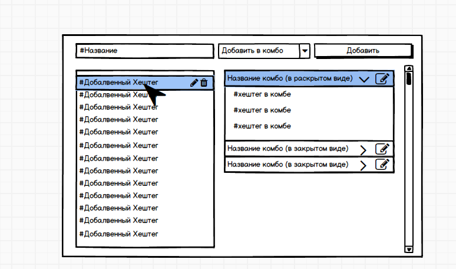

# https://ant.design - для интерфейса

# Использовать JS, React

#модуль ХешТегов

Задача сделать интерфейс, в котором пользователь сможет записать данные в виде хештегов и иметь возможность объединить несколько хештегов в одну группу.
Для пользователя это должно быть просто и понятно. Нарисованный прототип только предложение, как он может выглядеть. Если есть идеи, как сделать это удобно - надо сделать.

- **Интерфейс**

- **Строка название**: Пользователь вводит сам хештег. Может ввести с # или без #, результатом всё равно будет с одним #. Нельзя ввести с пробелом. Кнопка добавить, добавляет в список слева хештег. Если в списке уже есть такой, нужно вывести уведомление - Такой хештег уже добавлен.

- **Добавить в комбо:** Опция, позволяющая объединить несколько хетегов в одну группу.
  Если в этой опции выбрать название комбо, то при добавлении он добавится в комбо.

**Стандартные функции редактирования и удаления.**
